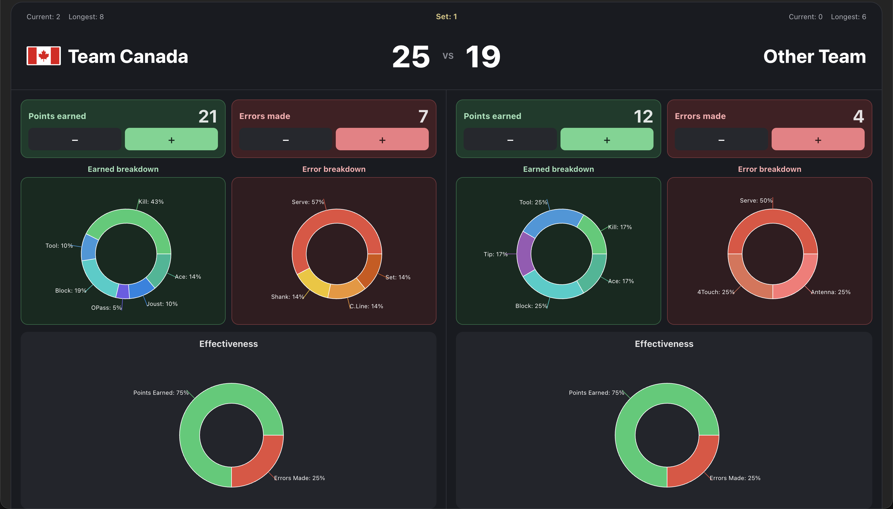
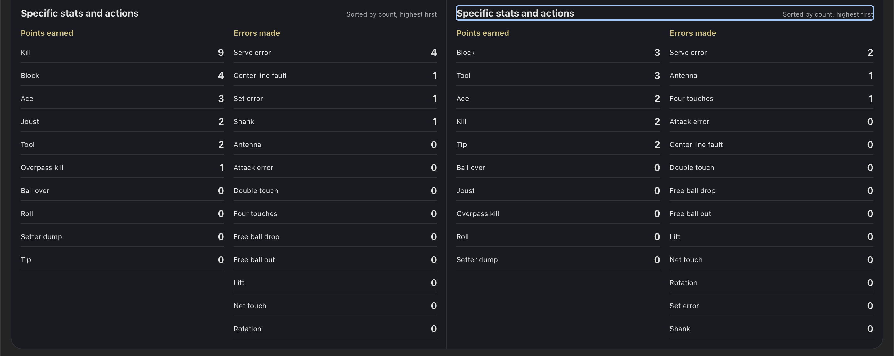
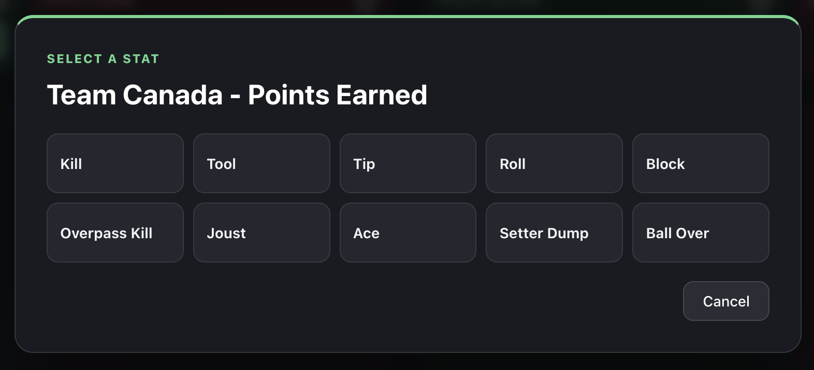
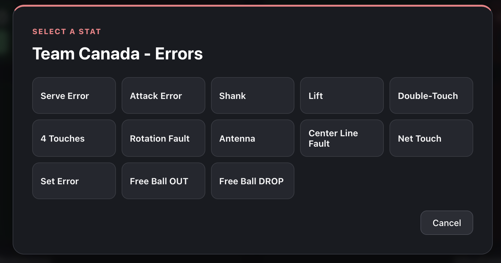
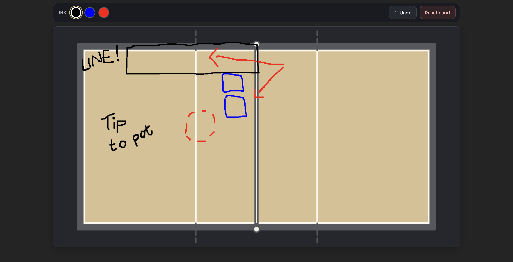
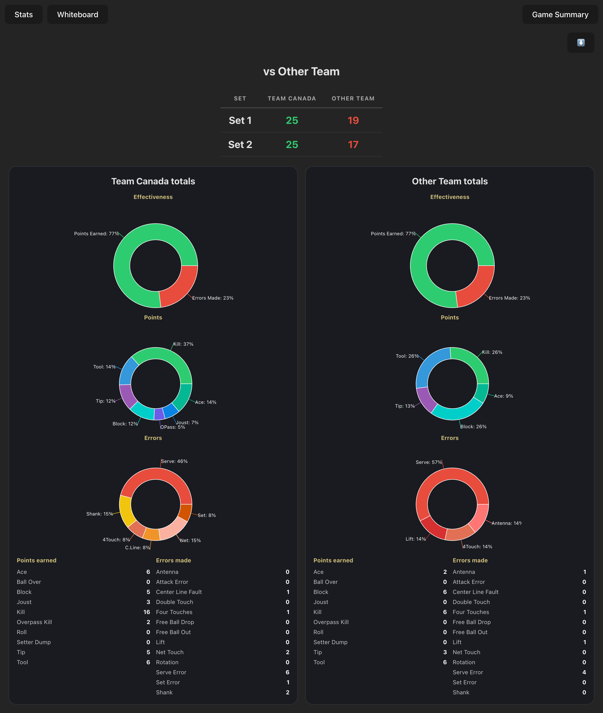

# Volleyball Stat Tracker

A courtside volleyball tracker for recording how each rally ends. Follow the score and team runs live, see earned-point and error patterns at a glance, sketch plays on a court, and review the match by set.

The screenshots below show the app in landscape view.

## Live match

The overview brings the score, set, current and longest runs, team totals, breakdown charts, and effectiveness charts together on one screen.

Expand a team's action list to see the specific earned points and errors. Counts are ordered from highest to lowest.

## Record stats

Choose a team and a point type, then select the action that ended the rally. The picker separates earned points from errors.

## Whiteboard

Sketch plays directly on the volleyball court. Choose an ink color, undo the last mark, or reset the court.

## Match summary

Review set scores, effectiveness, earned-point and error charts, and exact action totals for both teams. Export the summary as an image to share.

## Display

The stats view is designed for landscape screens, including tablets. In portrait orientation, the app asks the user to turn the device sideways so the scoreboard, teams, and charts remain visible together.

## Tech stack

| | |
| --- | --- |
| Framework | React 19 |
| Build tool | Vite 7 |
| Charts | Recharts |
| Drawing | HTML5 Canvas API |
| Image export | html2canvas |

## Current limitations

- Stats are held in React state, so refreshing the page clears the active match.
- Stats are recorded by team, not by individual player.
- Match history is not stored across games.
